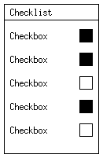

# The XORGUI Widget Toolkit (For X11)

A simple and minimalistic widget toolkit for X11, based on Xlib.  
The aim is to create a small widget toolkit that uses the least resources possible.  
I'm currently focusing on the functionality, a graphical overhaul will come later.

## Install the library to your system

```
cmake -S . -B build
cmake --build build 
sudo cmake --install build
```

Progress:
- [X] Label
- [X] Button
- [X] Checkbox
- [X] Checklist
- [X] Radio button
- [ ] Text field
- [ ] Slider
- [ ] List
- [ ] Scrollbar
- [ ] Progress bar
- [ ] Double buffering

## Test out the library
Test it out by building the project and running the *demo* provided.    
You can find the binary file inside cmake-build-debug.  
You can also modify src/main.c to test out the library.

## NOTES:
- CLion users should press the hammer button instead of the play button to compile.

## Images

Checklist

